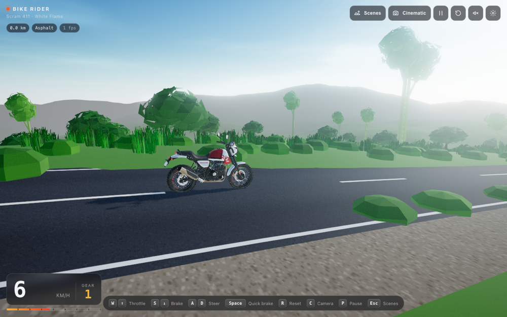
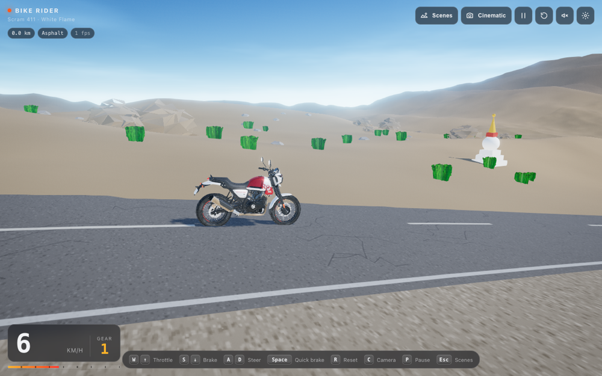
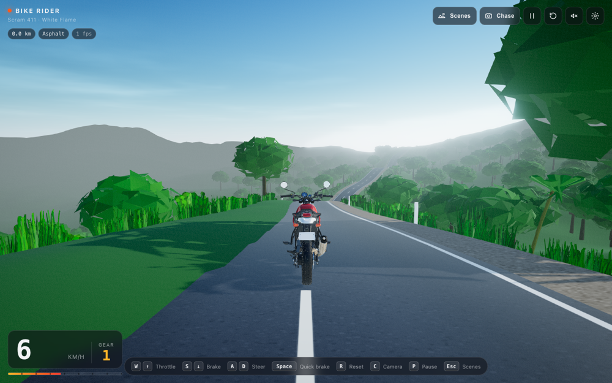
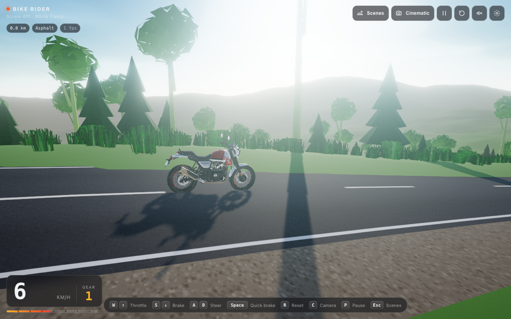
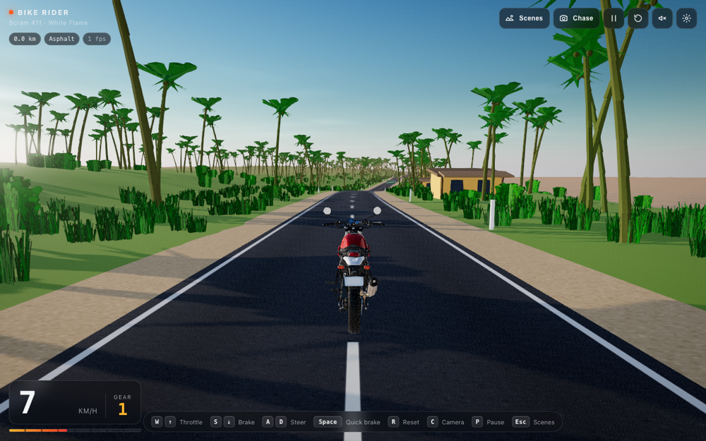
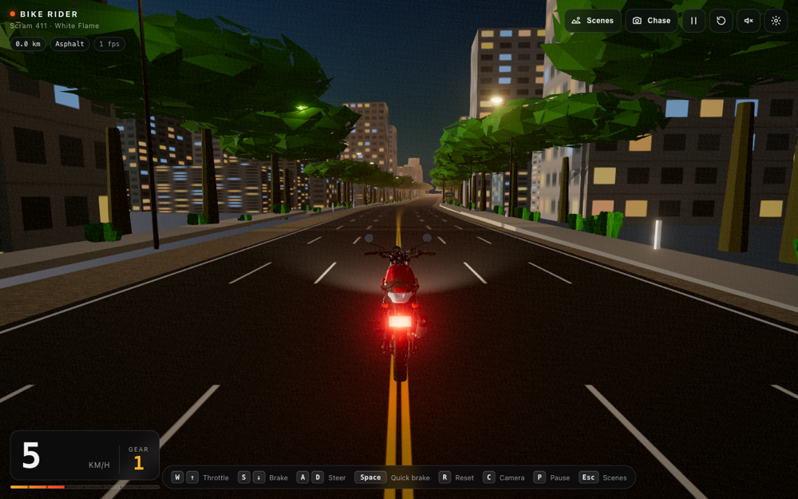
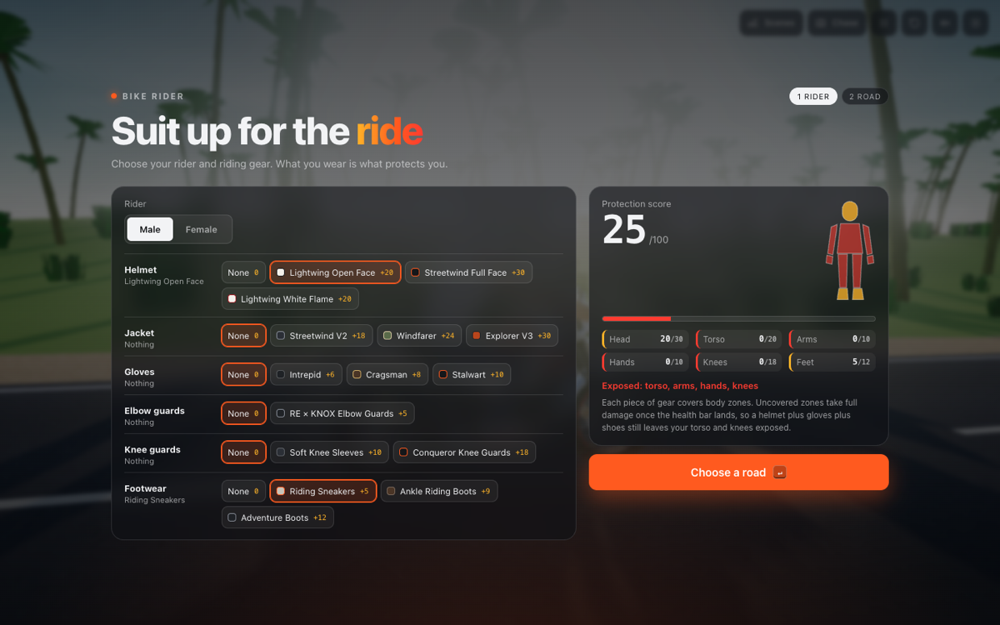
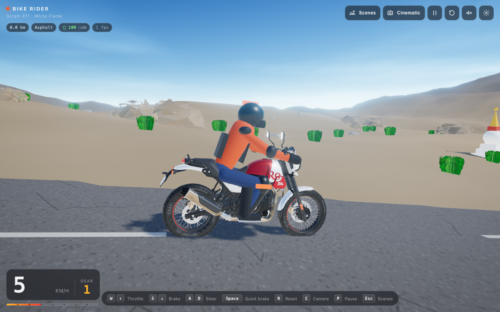

# Bike Rider

Ride a Royal Enfield Scram 411 through six Indian landscapes in the browser. Suit up your rider,
pick a road, then ride with WASD or the arrow keys.

|                                                       |                                                               |
| ----------------------------------------------------- | ------------------------------------------------------------- |
|  Munnar, tea hills          |  Leh–Ladakh, high desert        |
|  Wayanad, rainforest ghat |  Ooty, pine slopes                      |
|  Varkala, cliff beach     |  Bengaluru, ring road at dusk |

_Screenshots show the real Scram 411 model loaded locally via `npm run fetch-model` (see asset
provenance below)._

## Quick start

```bash
npm install
npm run dev        # http://localhost:5173
```

Other scripts:

```bash
npm run build      # type-check + production bundle in dist/
npm run preview    # serve dist/ locally
npm run lint       # eslint
npm run format     # prettier
```

Requires Node 18+ and a browser with WebGL (current Chrome, Edge, Firefox, Safari).
Browsers without WebGL get a fallback screen with troubleshooting steps instead of a blank page.

## Controls

| Action                                     | Keys              |
| ------------------------------------------ | ----------------- |
| Throttle                                   | `W` / `↑`         |
| Brake, then reverse                        | `S` / `↓`         |
| Steer                                      | `A` `D` / `←` `→` |
| Quick brake                                | `Space`           |
| Reset bike to the road                     | `R`               |
| Cycle camera (Chase → Cockpit → Cinematic) | `C`               |
| Pause                                      | `P`               |
| Scene select                               | `Esc`             |

On touch devices, on-screen steer / gas / brake buttons appear automatically. They can be
forced on or off in Settings.

## What's in the HUD

- Speed (km/h or mph), simulated 5-speed gear indicator and a tachometer bar.
- Distance ridden, current surface (asphalt / gravel / off-road) and FPS.
- Icon buttons for camera mode, pause, reset, engine sound and settings.
- Settings sheet: render quality (pixel ratio + shadows), time of day (day / dusk with
  headlights), camera, units, touch controls.
- An "off route" toast when you wander too far from the road; `R` snaps you back.

Settings persist in `localStorage`.

## Riding model

Arcade handling, not a physics engine (`src/game/BikePhysics.ts`):

- Longitudinal: throttle with power that tails off near the ~120 km/h top speed, brakes,
  engine braking, rolling + aerodynamic drag. Gravel and grass add rolling loss and cap speed.
- Steering: bicycle model (`yawRate = v / wheelbase · tan(steer)`) with the steering angle
  limited by a lateral-grip budget, so the bike stays agile at low speed and stable at high speed.
- Visual lean is derived from lateral acceleration; wheels spin from distance travelled; the
  front wheel turns about the real (raked) fork axis.
- Fixed 120 Hz simulation step, rendering at display refresh.

## Rider and gear



Before the road you build your rider: male or female body, then one item per slot from a
catalogue that follows Royal Enfield's riding-gear lines:

| Slot         | Options (points)                                                                                               |
| ------------ | -------------------------------------------------------------------------------------------------------------- |
| Helmet       | Lightwing Open Face (20), Lightwing White Flame (20), Streetwind Full Face (30)                                |
| Jacket       | Streetwind V2 mesh (12 torso + 6 arms), Windfarer touring (16 + 8), Explorer V3 with KNOX CE2 armour (20 + 10) |
| Gloves       | Intrepid (6), Cragsman (8), Stalwart (10)                                                                      |
| Elbow guards | RE × KNOX elbow cups (+5 arms)                                                                                 |
| Knee guards  | Soft knee sleeves (10), Conqueror CE Level 2 (18)                                                              |
| Footwear     | Riding sneakers (5), ankle riding boots (9), adventure boots (12)                                              |

**Protection score** (`src/game/gear.ts`) is the sum of covered body zones, capped per zone:
head 30, torso 20, arms 10, hands 10, knees 18, feet 12, total 100. Items that cover the same
zone do not stack past the cap. The gear screen shows the score, a body map tinted by coverage
and the list of exposed zones, e.g. helmet + gloves + shoes = 41/100 with torso, arms and knees
exposed. The in-ride HUD shows the score as a shield chip. This is the input for the upcoming
health bar: damage to an uncovered zone will hurt more.

The rider (`src/game/Rider.ts`) is a procedural low-poly figure seated on the bike, hands on the
bars, feet on the pegs, leaning with the bike. Gear is drawn as extra shells, so what you pick
is what you see riding: helmet type and livery, jacket colour with shoulder and elbow cups,
gauntlets, hard-shell knee guards, boot height. Product names reference Royal Enfield's
catalogue; the visuals are original stand-ins, not their product imagery.



## Scenes and world

Six hand-tuned scenes live in `src/world/scenes.ts`. Each one sets the sun, atmosphere, fog,
road geometry, terrain relief, palette and vegetation layers:

| Scene      | Category  | What you ride through                                                  |
| ---------- | --------- | ---------------------------------------------------------------------- |
| Munnar     | Hills     | Contour-planted tea bushes, shola trees, misty ridges                  |
| Leh–Ladakh | Mountains | Ochre high desert, snow-capped ridges, roadside chortens, dusty tarmac |
| Wayanad    | Greenery  | Dense rainforest canopy, hairpin ghat, wet-looking asphalt             |
| Ooty       | Hills     | Pine plantations, eucalyptus, grassy downs, low evening sun            |
| Varkala    | Beach     | Cliff-top road, coconut palms, cafe shacks, the Arabian Sea            |
| Bengaluru  | City      | Six-lane ring road, rain trees, lit towers and streetlights at dusk    |

How it is built (all procedural, no downloaded scenery assets):

- **Atmosphere** (`Atmosphere.ts`): three.js Preetham sky with a per-scene sun, an environment
  map baked from that sky (clamped, so it cannot poison PBR materials), sun + hemisphere
  lighting, exponential fog tinted from the horizon, and a bounded sun sprite for bloom.
- **Terrain** (`heights.ts`, `Terrain.ts`): one analytic height function feeds everything. Two
  levels of recycled heightfield chunks (64² near, 40² far) carry biome vertex colours by
  height, slope, snow line and shoreline. The road is cut into the terrain as a flat bench, and
  the bike, camera, props and road ribbon all sample the same function.
- **Road** (`roadPath.ts`, `Road.ts`): analytic centreline with per-scene curviness and an
  elevation profile; asphalt / dusty highway / six-lane city textures painted on canvas.
- **Vegetation** (`Vegetation.ts`): merged low-poly geometries (broadleaf, rain tree, pine,
  eucalyptus, palm, tea bush, shrub and grass billboards, rocks, boulders, chortens, shacks) as
  `InstancedMesh`es, seeded deterministically per 40 m tile.
- **Ocean** (`Ocean.ts`): animated Gerstner-style waves with Fresnel sky reflection and a sun
  highlight, matched to the scene fog.
- **City** (`City.ts`): instanced towers with day / emissive night facades, lampposts with pooled
  point lights, kerbs.
- **Post-processing** (`postfx/PostFX.ts`): HDR render target, bloom with an exposure-aware
  threshold, colour grade (saturation, contrast, split-tone, vignette, grain), SMAA. Off on Low.

Time of day (Settings) overrides the scene default: Noon, Golden hour or Night with headlights
and city lights.

## The bike and asset provenance

There are two bikes in this project.

### 1. The real Scram 411 model (local only, not in the repo)

Royal Enfield's [Scram 411 digital quick-start](https://www.royalenfield.com/in/en/support/digital-quickstart/scram411/explore/)
page renders a Draco-compressed GLB of the bike (713 nodes, 105 materials, real textures) in its
own Three.js viewer. This game can load that exact model:

```bash
npm run fetch-model   # downloads public/models/scram411.glb (11 MB) + the Draco decoder
npm run dev           # reload; the HUD shows "Loading Scram 411 model…" for a few seconds
```

**The model is Royal Enfield's copyrighted asset and has no published reuse licence, so this
repository does not redistribute it.** `public/models/` and `public/draco/` are gitignored; the
fetch script only downloads the file to your machine, the same way your browser does when you
open their page. Do not commit it or deploy it publicly without permission from Royal Enfield.

What the loader does (`loadExternalBike` in `src/game/Bike.ts`):

- Orients the model (its front points to -X) and fits the wheelbase to the physics config.
- Both wheels share single meshes in the source; they are split by triangle position into
  front and rear halves so each spins about its own axle.
- Fork, headlight, bars and mirrors are picked by position relative to the front axle and
  parented to the steering pivot, so the front end turns with the handlebars.
- The source livery is Graphite Red. With `WHITE_FLAME_RECOLOUR` on, the tank texture is
  recoloured at load time (red ↔ white) to approximate the White Flame scheme.

### 2. The procedural fallback (always available, original work)

If the model is absent the game silently uses `Bike` built from Three.js primitives: 19"/17"
spoked wheels with block tread, long-travel fork with gaiters, round headlight with a mini
cowl, finned single-cylinder engine, upswept exhaust, flat seat, mono-shock, and a fuel tank
painted at runtime with a canvas texture (white base, flame graphic, black knee stripe). This
is original work covered by the repository licence.

"Royal Enfield" and "Scram 411" are trademarks of their owner; this is a fan project and is not
affiliated with or endorsed by Royal Enfield.

### Using another GLB

Point `EXTERNAL_BIKE_MODEL` in `src/core/config.ts` at any GLB (relative to the site base).
The loader assumes the front faces -X and up is +Y; wheels are found by name (`wheel`, `rim`,
`tyre`, `spoke`) and the steering assembly by position, so most exported motorcycle models
work without renaming nodes.

## Dev aids

URL parameters (development only):

- `?scene=munnar|ladakh|wayanad|ooty|varkala|bengaluru` picks a scene; `?nomenu` skips the menu; `?step=scene` opens the menu on the road step.
- `?rider=male|female&gear=streetwind-full,explorer-v3,...` previews a loadout; `?closeup` orbits close to the rider.
- `?quality=low|medium|high` overrides the stored quality.
- `?autodrive` pins the throttle and follows the road, handy for screenshots and perf checks.
- In dev builds the game instance is exposed as `window.__bikeRider`.
- `?camera=chase|cockpit|cinematic`, `?time=auto|day|golden|night` override the stored settings for that load.

## Project layout

```
src/
  main.ts            WebGL detection, fallback screen, lazy-loads the game
  style.css          HUD, overlays, touch controls, fallback
  core/              config (tuning), settings persistence, input, WebGL probe
  game/              Game loop, Bike model, Rider + gear catalogue, BikePhysics, ChaseCamera, EngineAudio
  world/             scenes, heights, Terrain, Road, Vegetation, Ocean, City, Atmosphere, Dust
  postfx/            EffectComposer pipeline
  ui/                Hud (in-ride overlay), Menu (rider + gear, scene select)
scripts/fetch-model.mjs   downloads the Scram 411 GLB + Draco decoder (gitignored output)
public/previews/          scene thumbnails for the menu
```

## Deployment

`npm run build` emits a static site in `dist/` with relative asset paths (`base: './'`), so it
can be dropped on GitHub Pages, Netlify, Vercel or any static host with no configuration.

## Roadmap

- Health bar driven by the protection score: crashes and off-road hits damage exposed zones.
- Rider figure; ask Royal Enfield about licensing the model for a public deployment.
- Traffic, other riders, and checkpoints / a photo mode.
- Gamepad support and haptics on mobile.
- Post-processing (bloom for dusk headlights, motion blur at speed) behind the quality setting.
