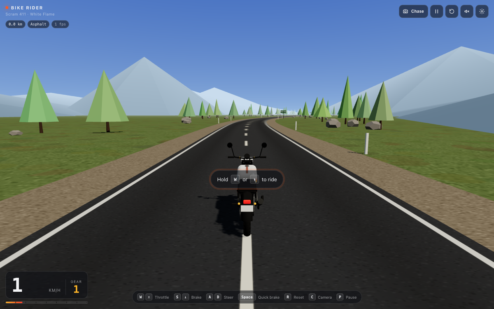

# Bike Rider

A browser-based Three.js riding game. You ride a Royal Enfield Scram 411 "White Flame"-inspired
motorcycle down an endless mountain road with WASD or the arrow keys. The 3D scene *is* the
first screen: no landing page, no menus to click through.



## Quick start

```bash
npm install
npm run dev        # http://localhost:5173
```

Other scripts:

```bash
npm run build      # type-check + production bundle in dist/
npm run preview    # serve dist/ locally
npm run lint       # eslint
npm run format     # prettier
```

Requires Node 18+ and a browser with WebGL (current Chrome, Edge, Firefox, Safari).
Browsers without WebGL get a fallback screen with troubleshooting steps instead of a blank page.

## Controls

| Action        | Keys                 |
| ------------- | -------------------- |
| Throttle      | `W` / `↑`            |
| Brake, then reverse | `S` / `↓`      |
| Steer         | `A` `D` / `←` `→`    |
| Quick brake   | `Space`              |
| Reset bike to the road | `R`         |
| Cycle camera (Chase → Cockpit → Cinematic) | `C` |
| Pause         | `P` or `Esc`         |

On touch devices, on-screen steer / gas / brake buttons appear automatically. They can be
forced on or off in Settings.

## What's in the HUD

- Speed (km/h or mph), simulated 5-speed gear indicator and a tachometer bar.
- Distance ridden, current surface (asphalt / gravel / off-road) and FPS.
- Icon buttons for camera mode, pause, reset, engine sound and settings.
- Settings sheet: render quality (pixel ratio + shadows), time of day (day / dusk with
  headlights), camera, units, touch controls.
- An "off route" toast when you wander too far from the road; `R` snaps you back.

Settings persist in `localStorage`.

## Riding model

Arcade handling, not a physics engine (`src/game/BikePhysics.ts`):

- Longitudinal: throttle with power that tails off near the ~120 km/h top speed, brakes,
  engine braking, rolling + aerodynamic drag. Gravel and grass add rolling loss and cap speed.
- Steering: bicycle model (`yawRate = v / wheelbase · tan(steer)`) with the steering angle
  limited by a lateral-grip budget, so the bike stays agile at low speed and stable at high speed.
- Visual lean is derived from lateral acceleration; wheels spin from distance travelled; the
  front wheel turns about the real (raked) fork axis.
- Fixed 120 Hz simulation step, rendering at display refresh.

## World

An analytic centreline (`src/world/roadPath.ts`) defines the road, so tiles, props, surface
tests and resets all agree on where the asphalt is. Road tiles are recycled ahead of the rider
(`src/world/Road.ts`), roadside trees / rocks / marker posts live in `InstancedMesh`es, distant
hills wrap along the route for parallax, and a gradient sky shader plus fog carry the day / dusk
presets. Dust particles kick up behind the rear wheel on gravel and under hard braking.

## The bike and asset provenance

**No Royal Enfield assets are used.** The plan called for checking whether the 3D preview on
Royal Enfield's Scram 411 quick-start page could be reused. That asset is Royal Enfield's
property with no published reuse licence, so it was not copied.

Instead, `src/game/Bike.ts` builds an original Scram 411-inspired model procedurally from
Three.js primitives: 19"/17" spoked wheels with block tread, long-travel fork with gaiters,
round headlight with a mini cowl, single-cylinder engine with cooling fins, upswept exhaust,
flat single-piece seat, mono-shock, and a fuel tank painted at runtime with a canvas texture
(white base, orange/red flame graphic, black knee stripe, twin racing stripe on top). All of
this is original work in this repository and is covered by the repository licence.

"Royal Enfield" and "Scram 411" are trademarks of their owner; this is a fan project and is not
affiliated with or endorsed by Royal Enfield.

### Swapping in a licensed GLB

If you obtain a properly licensed motorcycle model, set `EXTERNAL_BIKE_MODEL` in
`src/core/config.ts` to its URL (e.g. `'/models/scram411.glb'` with the file in `public/models/`).
Loading goes through `GLTFLoader`. For steering and wheel animation, name nodes in the model:

- `FrontWheel`, `RearWheel`: spun about their local X axis.
- `Steering`: fork + handlebar assembly, rotated about the steering axis.

The model is auto-scaled so the distance between the two wheel nodes matches the configured
1.455 m wheelbase. Keep textures ≤ 2048 px and prefer a single Draco- or Meshopt-compressed GLB.

## Dev aids

URL parameters (development only):

- `?autodrive` pins the throttle and follows the road, handy for screenshots and perf checks.
- `?camera=chase|cockpit|cinematic`, `?time=day|dusk` override the stored settings for that load.

## Project layout

```
src/
  main.ts            WebGL detection, fallback screen, lazy-loads the game
  style.css          HUD, overlays, touch controls, fallback
  core/              config (tuning), settings persistence, input, WebGL probe
  game/              Game loop, Bike model, BikePhysics, ChaseCamera, EngineAudio
  world/             World, Road tiles, roadPath, Sky shader, Dust, canvas textures
  ui/Hud.ts          DOM HUD and settings sheet
```

## Deployment

`npm run build` emits a static site in `dist/` with relative asset paths (`base: './'`), so it
can be dropped on GitHub Pages, Netlify, Vercel or any static host with no configuration.

## Roadmap

- Rider figure and richer bike detail; optional licensed GLB.
- Obstacles / traffic and a route with elevation changes.
- Gamepad support and haptics on mobile.
- Post-processing (bloom for dusk headlights, motion blur at speed) behind the quality setting.
