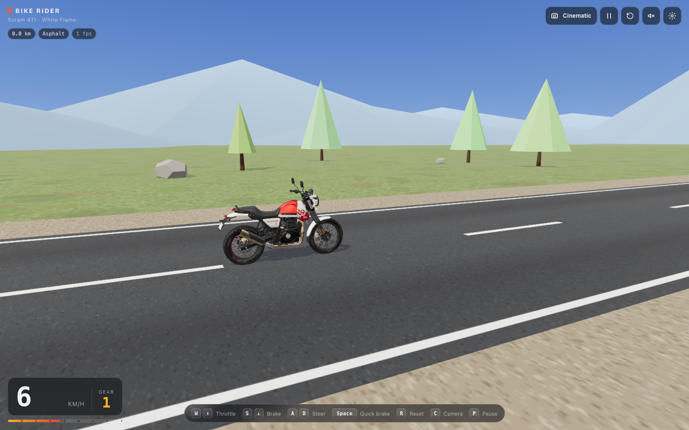

# Bike Rider

A browser-based Three.js riding game. You ride a Royal Enfield Scram 411 "White Flame"-inspired
motorcycle down an endless mountain road with WASD or the arrow keys. The 3D scene *is* the
first screen: no landing page, no menus to click through.




*Screenshots show the real Scram 411 model loaded locally via `npm run fetch-model` (see asset provenance below).*

## Quick start

```bash
npm install
npm run dev        # http://localhost:5173
```

Other scripts:

```bash
npm run build      # type-check + production bundle in dist/
npm run preview    # serve dist/ locally
npm run lint       # eslint
npm run format     # prettier
```

Requires Node 18+ and a browser with WebGL (current Chrome, Edge, Firefox, Safari).
Browsers without WebGL get a fallback screen with troubleshooting steps instead of a blank page.

## Controls

| Action        | Keys                 |
| ------------- | -------------------- |
| Throttle      | `W` / `↑`            |
| Brake, then reverse | `S` / `↓`      |
| Steer         | `A` `D` / `←` `→`    |
| Quick brake   | `Space`              |
| Reset bike to the road | `R`         |
| Cycle camera (Chase → Cockpit → Cinematic) | `C` |
| Pause         | `P` or `Esc`         |

On touch devices, on-screen steer / gas / brake buttons appear automatically. They can be
forced on or off in Settings.

## What's in the HUD

- Speed (km/h or mph), simulated 5-speed gear indicator and a tachometer bar.
- Distance ridden, current surface (asphalt / gravel / off-road) and FPS.
- Icon buttons for camera mode, pause, reset, engine sound and settings.
- Settings sheet: render quality (pixel ratio + shadows), time of day (day / dusk with
  headlights), camera, units, touch controls.
- An "off route" toast when you wander too far from the road; `R` snaps you back.

Settings persist in `localStorage`.

## Riding model

Arcade handling, not a physics engine (`src/game/BikePhysics.ts`):

- Longitudinal: throttle with power that tails off near the ~120 km/h top speed, brakes,
  engine braking, rolling + aerodynamic drag. Gravel and grass add rolling loss and cap speed.
- Steering: bicycle model (`yawRate = v / wheelbase · tan(steer)`) with the steering angle
  limited by a lateral-grip budget, so the bike stays agile at low speed and stable at high speed.
- Visual lean is derived from lateral acceleration; wheels spin from distance travelled; the
  front wheel turns about the real (raked) fork axis.
- Fixed 120 Hz simulation step, rendering at display refresh.

## World

An analytic centreline (`src/world/roadPath.ts`) defines the road, so tiles, props, surface
tests and resets all agree on where the asphalt is. Road tiles are recycled ahead of the rider
(`src/world/Road.ts`), roadside trees / rocks / marker posts live in `InstancedMesh`es, distant
hills wrap along the route for parallax, and a gradient sky shader plus fog carry the day / dusk
presets. Dust particles kick up behind the rear wheel on gravel and under hard braking.

## The bike and asset provenance

There are two bikes in this project.

### 1. The real Scram 411 model (local only, not in the repo)

Royal Enfield's [Scram 411 digital quick-start](https://www.royalenfield.com/in/en/support/digital-quickstart/scram411/explore/)
page renders a Draco-compressed GLB of the bike (713 nodes, 105 materials, real textures) in its
own Three.js viewer. This game can load that exact model:

```bash
npm run fetch-model   # downloads public/models/scram411.glb (11 MB) + the Draco decoder
npm run dev           # reload; the HUD shows "Loading Scram 411 model…" for a few seconds
```

**The model is Royal Enfield's copyrighted asset and has no published reuse licence, so this
repository does not redistribute it.** `public/models/` and `public/draco/` are gitignored; the
fetch script only downloads the file to your machine, the same way your browser does when you
open their page. Do not commit it or deploy it publicly without permission from Royal Enfield.

What the loader does (`loadExternalBike` in `src/game/Bike.ts`):

- Orients the model (its front points to -X) and fits the wheelbase to the physics config.
- Both wheels share single meshes in the source; they are split by triangle position into
  front and rear halves so each spins about its own axle.
- Fork, headlight, bars and mirrors are picked by position relative to the front axle and
  parented to the steering pivot, so the front end turns with the handlebars.
- The source livery is Graphite Red. With `WHITE_FLAME_RECOLOUR` on, the tank texture is
  recoloured at load time (red ↔ white) to approximate the White Flame scheme.

### 2. The procedural fallback (always available, original work)

If the model is absent the game silently uses `Bike` built from Three.js primitives: 19"/17"
spoked wheels with block tread, long-travel fork with gaiters, round headlight with a mini
cowl, finned single-cylinder engine, upswept exhaust, flat seat, mono-shock, and a fuel tank
painted at runtime with a canvas texture (white base, flame graphic, black knee stripe). This
is original work covered by the repository licence.

"Royal Enfield" and "Scram 411" are trademarks of their owner; this is a fan project and is not
affiliated with or endorsed by Royal Enfield.

### Using another GLB

Point `EXTERNAL_BIKE_MODEL` in `src/core/config.ts` at any GLB (relative to the site base).
The loader assumes the front faces -X and up is +Y; wheels are found by name (`wheel`, `rim`,
`tyre`, `spoke`) and the steering assembly by position, so most exported motorcycle models
work without renaming nodes.

## Dev aids

URL parameters (development only):

- `?autodrive` pins the throttle and follows the road, handy for screenshots and perf checks.
- In dev builds the game instance is exposed as `window.__bikeRider`.
- `?camera=chase|cockpit|cinematic`, `?time=day|dusk` override the stored settings for that load.

## Project layout

```
src/
  main.ts            WebGL detection, fallback screen, lazy-loads the game
  style.css          HUD, overlays, touch controls, fallback
  core/              config (tuning), settings persistence, input, WebGL probe
  game/              Game loop, Bike model, BikePhysics, ChaseCamera, EngineAudio
  world/             World, Road tiles, roadPath, Sky shader, Dust, canvas textures
  ui/Hud.ts          DOM HUD and settings sheet
```

## Deployment

`npm run build` emits a static site in `dist/` with relative asset paths (`base: './'`), so it
can be dropped on GitHub Pages, Netlify, Vercel or any static host with no configuration.

## Roadmap

- Rider figure; ask Royal Enfield about licensing the model for a public deployment.
- Obstacles / traffic and a route with elevation changes.
- Gamepad support and haptics on mobile.
- Post-processing (bloom for dusk headlights, motion blur at speed) behind the quality setting.
